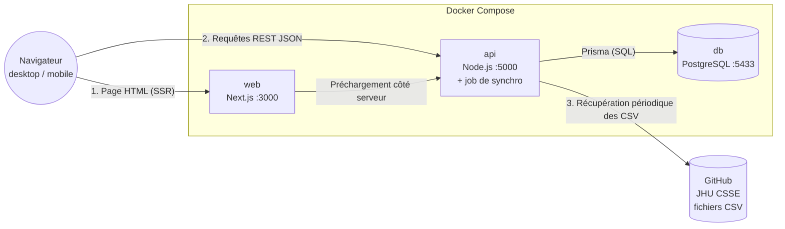
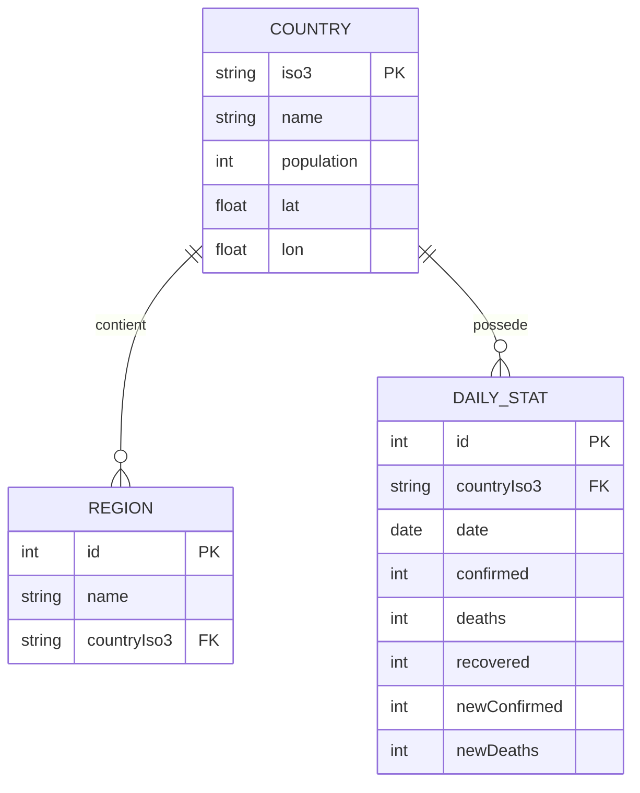

# ADR — CovidDataViz

Architecture Decision Record : stack technique et architecture du projet.

## 1. Vue d'ensemble de la stack

| Couche          | Technologie                                 | Rôle                                           |
| --------------- | ------------------------------------------- | ---------------------------------------------- |
| Frontend        | Next.js (App Router) + React + TypeScript   | Interface, routage, rendu serveur              |
| UI              | Tailwind CSS + shadcn/ui                    | Style utilitaire, composants accessibles       |
| Graphiques      | shadcn charts (Recharts)                    | Courbes d'évolution                            |
| Carte           | react-simple-maps (D3-geo)                  | Carte du monde                                 |
| API             | Node.js + TypeScript                        | Endpoints REST, validation, cache              |
| ORM             | Prisma                                      | Modèle de données, migrations                  |
| Base de données | PostgreSQL                                  | Stockage des séries temporelles                |
| Infra           | Docker + Docker Compose                     | 3 services isolés, environnement reproductible |
| Qualité         | ESLint, Prettier, Husky, Vitest, Playwright | Lint, format, tests                            |
| CI              | GitHub Actions                              | Lint, typecheck, tests, build à chaque PR      |
| Suivi projet    | YouTrack                                    | Tickets, sprints, Gantt                        |

## 2. Décisions et justifications

### ADR-01 : Next.js + React pour le frontend

**Décision :** Next.js (App Router).  
**Justification :** rendu serveur natif (premier affichage rapide, important sur mobile), routage par fichiers, écosystème et documentation matures.

### ADR-02 : Tailwind + shadcn/ui pour l'UI

**Décision :** Tailwind CSS avec la bibliothèque de composants shadcn/ui.  
**Justification :** composants copiés dans le projet, thème sombre/clair simple à implémenter,.

### ADR-03 : API séparée du frontend

**Décision :** une API Node.js/TypeScript indépendante, plutôt que les route handlers de Next.js.  
**Justification :** exigence explicite du projet (frontend, API et base sur des ports distincts). L'API reste réutilisable par d'autres clients et porte le job de synchronisation périodique des données.

### ADR-04 : PostgreSQL + Prisma pour la persistance

**Décision :** PostgreSQL comme base de données, Prisma comme ORM.  
**Justification :** PostgreSQL gère bien les agrégations et requêtes par plage de dates nécessaires aux séries temporelles. Prisma donne un schéma déclaratif, des migrations versionnées et des types générés partagés avec le frontend.

### ADR-05 : Docker Compose pour l'environnement

**Décision :** un service par brique (web, api, db), chacun avec son port, orchestrés par Docker Compose.  
**Justification :** reproductibilité (`docker compose up` lance tout), conforme à l'exigence de ports distincts, healthchecks et volumes persistants pour la base.

### ADR-06 : Sous-ensemble des données JHU CSSE

**Décision :** n'importer que `csse_covid_19_time_series` (confirmés / décès / guérisons, niveau mondial) et `UID_ISO_FIPS_LookUp_Table.csv` (métadonnées pays). Les rapports quotidiens et les données US par comté sont hors périmètre.  
**Justification :** le dépôt est volumineux (plus de 1 100 colonnes par fichier). Avec ~30 jours de travail disponibles, un périmètre maîtrisé est préférable à une couverture large mais inachevée.

## 3. Architecture

### 3.1 Services et ports

| Service | Port     | Rôle                                         |
| ------- | -------- | -------------------------------------------- |
| `web`   | **3000** | Application Next.js                          |
| `api`   | **5000** | API REST + job de synchronisation périodique |
| `db`    | **5433** | PostgreSQL                                   |

### 3.2 Schéma des briques



### 3.4 Modèle de données (simplifié)



Un index sur `(countryIso3, date)` garantit des requêtes rapides sur les séries temporelles.

### 3.5 Endpoints principaux de l'API

| Endpoint                              | Usage                                                                |
| ------------------------------------- | -------------------------------------------------------------------- |
| `GET /health`                         | Vérifie que l'API et la base répondent                               |
| `GET /api/summary`                    | KPI mondiaux (confirmés, décès, guérisons, actifs, tendance 7 jours) |
| `GET /api/countries`                  | Liste des pays + valeurs pour la carte                               |
| `GET /api/timeseries`                 | Série temporelle mondiale                                            |
| `GET /api/countries/:iso3/timeseries` | Série temporelle d'un pays                                           |
| `GET /api/rankings`                   | Classements (absolu, pour 100 000, tendance)                         |
| `GET /api/compare?countries=FRA,USA`  | Comparaison de pays (jusqu'à 5)                                      |

### 3.6 Structure du dépôt

```
covid-data-viz/
├── apps/
│   ├── web/          # Next.js (port 3000)
│   └── api/          # Node.js + Prisma (port 5000)
├── packages/
│   └── shared/       # Types et schémas Zod partagés
├── docs/             # ADR, schémas, documentation
├── docker-compose.yml
└── .github/workflows # CI
```
