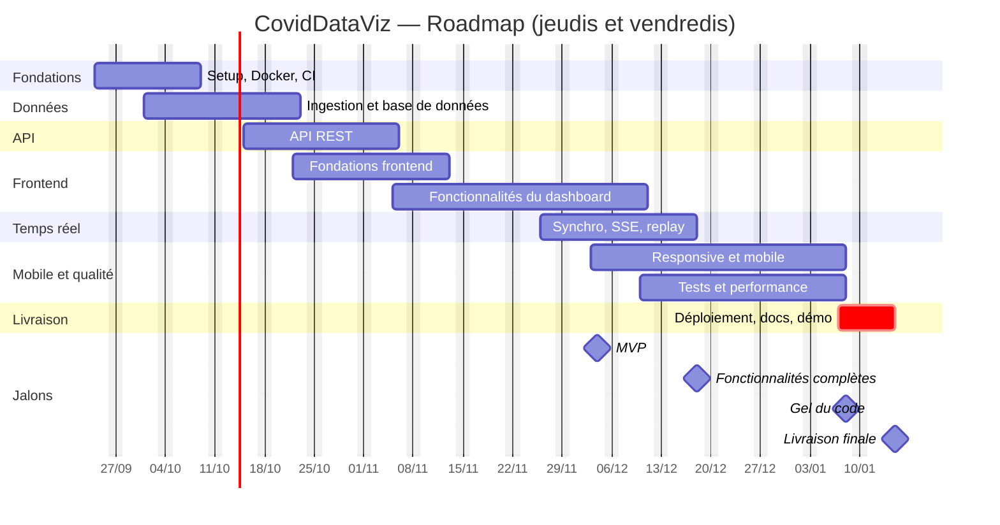

# SUJET — CovidDataViz

Contexte du projet, méthodologie de travail et roadmap.

---

## 1. Le projet

### 1.1 Concept et besoin

**CovidDataViz** est un tableau de bord web synthétique qui exploite et visualise les données mondiales de la pandémie de Covid-19 (cas confirmés, décès, guérisons), utilisable sur ordinateur et sur mobile.

**Le besoin :**

- Les données publiques (dépôt GitHub du CSSE de Johns Hopkins) sont exhaustives mais inexploitables telles quelles : fichiers CSV « larges » avec une colonne par jour (plus de 1 100 colonnes), sans visualisation, sans agrégation par pays fiable.
- Les tableaux de bord existants sont figés, surchargés, ou mal adaptés au mobile.
- Il manque une vue lisible en 10 secondes de la situation mondiale, avec la possibilité de creuser pays par pays.

### 1.2 Objectifs

| #   | Objectif                                                       | Indicateur de réussite                                             |
| --- | -------------------------------------------------------------- | ------------------------------------------------------------------ |
| O1  | Transformer les données brutes en base propre et interrogeable | Import complet et rejouable sans doublon, contrôles qualité passés |
| O2  | Offrir une vue synthétique mondiale                            | KPI + carte + courbes visibles sur un seul écran                   |
| O3  | Permettre l'exploration par pays et la comparaison             | Page pays + comparaison jusqu'à 5 pays                             |
| O4  | Donner une expérience « temps réel »                           | Mise à jour sans rechargement + mode replay                        |
| O5  | Fonctionner sur desktop et mobile                              | Vues validées à 360 / 768 / 1280 px, Lighthouse mobile ≥ 85        |
| O6  | Livrer un projet propre et reproductible                       | Stack lancée avec `docker compose up`, documentation complète      |

### 1.3 Public cible

| Utilisateur              | Besoin                                | Ce qu'on lui apporte                                                |
| ------------------------ | ------------------------------------- | ------------------------------------------------------------------- |
| Grand public curieux     | Comprendre l'évolution de la pandémie | KPI clairs, carte interactive, replay                               |
| Étudiants / enseignants  | Support pédagogique                   | Graphiques comparables, données sourcées                            |
| Journalistes / analystes | Comparer des pays rapidement          | Comparaison multi-pays, classements, valeurs pour 100 000 habitants |

### 1.4 Fonctionnalités principales

**Socle (MVP) :** cartes KPI mondiales, carte du monde interactive, courbes d'évolution globales, page détail d'un pays, interface responsive.

**Après le MVP :** comparaison de pays, classements triables, filtres globaux, mise à jour en direct, mode replay, thème sombre / clair, accessibilité.

### 1.5 Valeur ajoutée

- Données nettoyées et normalisées (agrégation des provinces par pays, codes ISO3, valeurs pour 100 000 habitants) pour rendre les pays comparables entre eux.
- Expérience « vivante » grâce au mode replay, qui transforme un historique en récit visuel.
- Mobile pensé dès la conception, pas seulement rétréci depuis le desktop.
- Architecture extensible : la source de données est isolée derrière une interface, d'autres jeux (vaccination, données US) pourront être ajoutés sans réécrire le projet.

### 1.6 Justification des choix de périmètre

| Choix                                                  | Justification                                                                                                                                                                                       |
| ------------------------------------------------------ | --------------------------------------------------------------------------------------------------------------------------------------------------------------------------------------------------- |
| Sous-ensemble de données seulement                     | Environ 30 jours de travail disponibles ; mieux vaut un périmètre maîtrisé et livré que tout survoler                                                                                               |
| Dashboard synthétique plutôt qu'outil d'analyse avancé | Le sujet demande un tableau de bord _synthétique_ ; priorité à la lisibilité                                                                                                                        |
| « Temps réel » = synchro + replay                      | Le dépôt JHU CSSE est archivé depuis mars 2023 (données du 22/01/2020 au 09/03/2023) ; on construit le mécanisme complet et le replay, avec la possibilité de brancher une source vivante plus tard |
| Priorité au MVP visible                                | KPI + carte + courbes en premier : c'est ce qui prouve la valeur du projet                                                                                                                          |

---

## 2. Méthodologie de travail

### 2.1 Contraintes d'organisation

| Contrainte                                 | Conséquence                                             |
| ------------------------------------------ | ------------------------------------------------------- |
| Travail uniquement les jeudis et vendredis | Cycles courts, planification à chaque début de session  |
| Échéance ferme : vendredi 15 janvier 2027  | Priorisation stricte, MVP défini tôt, marge de sécurité |
| ~15 semaines utiles (~30 jours de travail) | Peu de temps mort possible                              |
| Pause supposée les 24-25/12 et 31/12-01/01 | Aucune tâche planifiée ces jours-là                     |

### 2.2 Organisation et responsabilités

Projet en solo : plusieurs rôles portés par une seule personne, identifiés explicitement pour ne rien oublier.

| Rôle                       | Responsabilité                         |
| -------------------------- | -------------------------------------- |
| Product owner              | Définir le MVP, arbitrer le périmètre  |
| Développeur backend / data | Ingestion, base de données, API        |
| Développeur frontend / UI  | Interface, visualisations, responsive  |
| DevOps                     | Docker, CI, déploiement                |
| QA                         | Tests, qualité de données, performance |
| Documentaliste             | README, ADR, schémas, démo             |

Le référent / l'enseignant joue le rôle de client lors des points d'avancement.

### 2.3 Méthode : Scrumban léger

Combinaison de Scrum (sprints courts avec objectif, revue et rétrospective) et de Kanban (flux continu, limite du travail en cours)

| Élément                          | Choix                                     |
| -------------------------------- | ----------------------------------------- |
| Durée d'un sprint                | 2 semaines (4 jours de travail effectifs) |
| Nombre de sprints                | ~7 jusqu'à la livraison                   |
| Limite de travail en cours (WIP) | 2 tickets maximum en « In Progress »      |
| Statuts YouTrack                 | Open → In Progress → To Verify → Done     |
| Priorités                        | Critical (bloquant MVP), Major, Normal    |

### 2.4 Outils

| Besoin                  | Outil                   |
| ----------------------- | ----------------------- |
| Tickets, sprints, Gantt | YouTrack (projet `COV`) |
| Code et versionnement   | Git + GitHub            |
| Intégration continue    | GitHub Actions          |
| Environnement           | Docker / Docker Compose |
| Documentation           | Markdown dans `/docs`   |

### 2.5 Fréquence des points d'avancement

| Rythme                | Moment        | Contenu                                                      |
| --------------------- | ------------- | ------------------------------------------------------------ |
| Chaque session        | Jeudi matin   | Relire le sprint, choisir les tickets, vérifier les blocages |
| Chaque session        | Vendredi soir | Mettre à jour YouTrack                                       |
| Toutes les 2 semaines | Vendredi      | Revue de sprint : démonstration de ce qui marche             |
| Toutes les 2 semaines | Vendredi      | Rétrospective                                                |

**Règle de dérive :** si un jalon prend plus d'une session de retard, on décale ou retire des tickets de priorité `Normal` plutôt que de compresser les tests.

---

## 3. Roadmap

### 3.1 Calendrier

- Début : jeudi 24 septembre 2026
- Livraison finale : vendredi 15 janvier 2027
- Rythme : jeudis et vendredis uniquement (~30 jours de travail)

### 3.2 Grandes étapes

| #   | Étape                        | Période       | Résultat attendu                                             |
| --- | ---------------------------- | ------------- | ------------------------------------------------------------ |
| 1   | Fondations et infrastructure | 24/09 → 09/10 | Monorepo, Docker (3 services, 3 ports), CI                   |
| 2   | Données                      | 01/10 → 23/10 | Base PostgreSQL remplie, import rejouable, contrôles qualité |
| 3   | API                          | 15/10 → 06/11 | Endpoints documentés, validés, mis en cache                  |
| 4   | Fondations frontend          | 22/10 → 13/11 | Application shell, design system, couche de données          |
| 5   | Fonctionnalités du dashboard | 05/11 → 11/12 | KPI, carte, courbes, pays, comparaison, classements, filtres |
| 6   | Temps réel et replay         | 26/11 → 18/12 | Mise à jour en direct, mode replay                           |
| 7   | Responsive et mobile         | 03/12 → 08/01 | Expérience mobile finalisée, accessibilité, performance      |
| 8   | Tests et qualité             | 10/12 → 08/01 | Tests unitaires, intégration, E2E, corrections               |
| 9   | Livraison                    | 07/01 → 15/01 | Docker de production, documentation, démo                    |

### 3.3 Gantt simplifié

Le Gantt détaillé (58 tickets avec dates de début et de fin) est disponible dans YouTrack, projet `COV`.

### 3.4 MVP clairement défini

**Le MVP est atteint le vendredi 4 décembre 2026.**

| Inclus dans le MVP                                 |
| -------------------------------------------------- |
| Données importées dans PostgreSQL et rejouables    |
| API : résumé, pays, séries temporelles             |
| Application Next.js dans Docker, connectée à l'API |
| Cartes KPI mondiales                               |
| Carte du monde interactive                         |
| Courbes d'évolution globales                       |
| Page détail d'un pays                              |
| Mise en page responsive de base                    |
| `docker compose up` lance les trois services       |

**Critère de validation :** une personne extérieure ouvre l'application sur son téléphone, comprend la situation mondiale et peut consulter un pays sans aide.

### 3.5 Fonctionnalités prévues après le MVP

| Priorité    | Fonctionnalité                                                     | Période        |
| ----------- | ------------------------------------------------------------------ | -------------- |
| Haute       | Filtres globaux (période, métrique, par 100 000)                   | 10-11/12       |
| Haute       | Mises à jour en direct (SSE) + indicateur « dernière mise à jour » | 03-11/12       |
| Moyenne     | Classements triables                                               | 04-10/12       |
| Moyenne     | Comparaison de pays                                                | 03-04/12       |
| Moyenne     | Mode replay de la chronologie                                      | 17-18/12       |
| Moyenne     | Mobile : carte tactile, navigation, performance                    | 10/12 → 08/01  |
| Basse       | Accessibilité (WCAG AA de base)                                    | 18/12          |
| Idée future | Autres jeux de données, source live                                | hors périmètre |

### 3.6 Jalons intermédiaires

| Date       | Jalon                     | Condition de réussite                                                      |
| ---------- | ------------------------- | -------------------------------------------------------------------------- |
| Ven. 09/10 | Infra prête               | `docker compose up` lance web, API et base sur 3 ports distincts, CI verte |
| Ven. 23/10 | Données prêtes            | Import complet, contrôles qualité passés, base indexée                     |
| Ven. 06/11 | API prête                 | Endpoints documentés (OpenAPI), cache actif                                |
| Ven. 13/11 | Frontend prêt             | Application shell connectée à l'API, thème, états de chargement            |
| Ven. 04/12 | **MVP**                   | Voir 3.4                                                                   |
| Ven. 18/12 | Fonctionnalités complètes | Filtres, temps réel, replay, comparaison, classements                      |
| Ven. 08/01 | **Gel du code**           | Plus de nouvelles fonctionnalités, seulement des corrections               |
| Ven. 15/01 | **Livraison finale**      | Stack de production, documentation, démo                                   |

### 3.7 Phase de tests

Les tests commencent dès l'ingestion et s'étendent progressivement, ils ne sont pas repoussés à la fin.

| Type                                              | Quand                  | Outil                        |
| ------------------------------------------------- | ---------------------- | ---------------------------- |
| Contrôles qualité des données                     | Dès l'ingestion (oct.) | Script de vérification       |
| Tests unitaires (parseur, calculs, handlers)      | 10-11/12               | Vitest                       |
| Tests d'intégration API + base                    | 17/12                  | Vitest + PostgreSQL de test  |
| Tests E2E (parcours critiques, desktop et mobile) | 18/12                  | Playwright                   |
| Profilage des performances                        | 07/01                  | Lighthouse, logs de requêtes |
| CI à chaque pull request                          | En continu             | GitHub Actions               |

### 3.8 Corrections, améliorations et livraison

| Période  | Activité                                                             |
| -------- | -------------------------------------------------------------------- |
| 07-08/01 | Marge de correction (bugs trouvés en test et QA), performance mobile |
| 07-08/01 | Docker de production                                                 |
| 08-14/01 | Documentation complète                                               |
| 14/01    | Préparation de la démo                                               |
| 15/01    | Vérification finale et livraison                                     |

### 3.9 Plan de repli si le calendrier dérape

Si le retard dépasse une session, on retire dans cet ordre, **sans toucher au MVP ni aux tests** :

1. Accessibilité avancée
2. Mode replay
3. Comparaison de pays
4. Classements

Ces fonctionnalités sont indépendantes du reste : les retirer ne casse aucune autre fonctionnalité.
